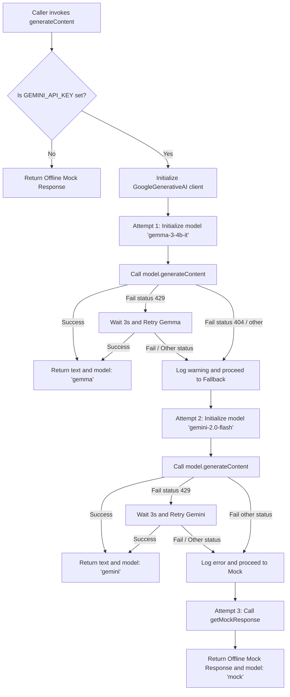

# AI Provider Audit

This document details the configuration, usage, and status of AI models and providers in **FirstReport**, specifically focusing on the root causes of the `404 Not Found` and `429 Too Many Requests` errors.

---

## 1. AI Model Configurations & Locations

| Component | File / Target | Configured Model(s) / Services |
| :--- | :--- | :--- |
| **Main AI Client** | [src/lib/ai.ts](file:///Users/flash/Desktop/firstReport/src/lib/ai.ts) | Primary: `gemma-3-4b-it` Fallback: `gemini-2.0-flash` |
| **Vision / Cloud OCR** | [src/app/api/ocr/process/route.ts](file:///Users/flash/Desktop/firstReport/src/app/api/ocr/process/route.ts) | Model: `gemini-2.0-flash` |
| **STT & TTS API** | [src/lib/sarvam.ts](file:///Users/flash/Desktop/firstReport/src/lib/sarvam.ts) | Providers: Sarvam AI (`saaras:v3` for STT, `bulbul:v3` for TTS) |
| **Environment Configuration** | [.env.local](file:///Users/flash/Desktop/firstReport/.env.local) | `GEMINI_API_KEY` `HUGGINGFACE_API_KEY` `SARVAM_API_KEY` |
| **Deprecated Local AI (Stub)** | [src/lib/ai/localAI.ts](file:///Users/flash/Desktop/firstReport/src/lib/ai/localAI.ts) | Model: `gemma-3-4b-it` (marked deprecated / local Ollama disabled) |
| **Deprecated HF Gemma (Stub)** | [src/lib/gemma-hf.ts](file:///Users/flash/Desktop/firstReport/src/lib/gemma-hf.ts) | Marked deprecated (file intentionally exports nothing) |

---

## 2. API Providers Audit

### 1. Google AI Studio (Gemini SDK)
*   **Usage:** Serves as the primary infrastructure for text generation and document verification OCR.
*   **SDK Used:** `@google/generative-ai` (which targets the `v1beta` API version under the hood).
*   **Configured Models:** `gemma-3-4b-it` (Primary) and `gemini-2.0-flash` (Fallback & OCR).
*   **API Key Source:** `process.env.GEMINI_API_KEY` (and `process.env.GOOGLE_AI_API_KEY` for OCR).

### 2. Hugging Face
*   **Usage:** Deprecated.
*   **Configured API Key:** `HUGGINGFACE_API_KEY` exists in `.env.local` but the client wrapper `src/lib/gemma-hf.ts` is deprecated/removed and not called by any active module.

### 3. Local Models (Ollama)
*   **Usage:** Deprecated/Removed.
*   **Configured Models:** Deprecated stub for `gemma-3-4b-it` under `src/lib/ai/localAI.ts` always returns `available: false`.

### 4. Sarvam AI (Other Provider)
*   **Usage:** Voice capability (Speech-To-Text / Text-To-Speech) for 11 Indic languages.
*   **Configured API Key:** `process.env.SARVAM_API_KEY`.

---

## 3. Execution Path Trace: `src/lib/ai.ts`

When a caller executes `generateContent(prompt)`:

---

## 4. Resolution Analysis

### 1. Which provider actually receives requests?
*   **Google AI Studio API / Gemini API** receives all text generation and vision requests via the `@google/generative-ai` SDK client.

### 2. Which API key is being used?
*   **`GEMINI_API_KEY`** (configure it in [.env.local](/Users/flash/Desktop/firstReport/.env.local)).

### 3. Is `gemma-3-4b-it` supported by that provider?
*   **No.** `gemma-3-4b-it` is an open-weights model. Hosted Google AI Studio / Gemini API endpoints (such as those queried under `v1beta/models/...`) do not host `gemma-3-4b-it` directly for hosted serverless generation. To call open Gemma models via Google AI Studio API, developers must target the active cloud-hosted Gemma models (such as `gemma-2-2b-it`, `gemma-2-9b-it`, `gemma-2-27b-it` or `gemma-4-31b-it` if available on the model service list), or host them locally / via a third-party model hosting platform. Direct invocation of `gemma-3-4b-it` via the SDK results in the observed `404 Not Found` error.

### 4. Does the configured API key have active quota?
*   **No.** Gemini fallback requests to `gemini-2.0-flash` consistently fail with `429 Too Many Requests`. The Google AI API response explicitly states:
    `Quota exceeded for metric: generativelanguage.googleapis.com/generate_content_free_tier_requests, limit: 0, model: gemini-2.0-flash`
    A quota limit of `0` indicates the API key's free tier allocation is exhausted, or the API key is restricted and has not been allowed requests for the model.

### 5. Are billing or project configurations preventing requests?
*   **Yes.** The `limit: 0` for free tier requests on `gemini-2.0-flash` indicates that the project configuration requires billing enablement (pay-as-you-go) to proceed beyond the exhausted/zeroed free tier limit, or the project lacks the necessary permissions to call the `gemini-2.0-flash` model under the free tier.

---

## 5. Root Causes

*   **Root Cause of `404 Not Found` (Gemma 3):** The model ID `gemma-3-4b-it` is not an active hosted model identifier supported by Google AI Studio API's `v1beta` endpoint. The SDK returns a 404 because the model cannot be found in Google's cloud catalog.
*   **Root Cause of `429 Too Many Requests` (Gemini Flash):** The configured API key has exhausted its free tier quota allocation for `gemini-2.0-flash` (`limit: 0` active limit), causing Google AI Studio to reject all fallback requests.
